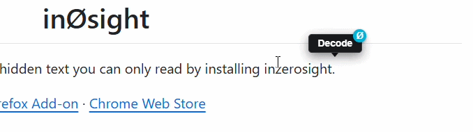
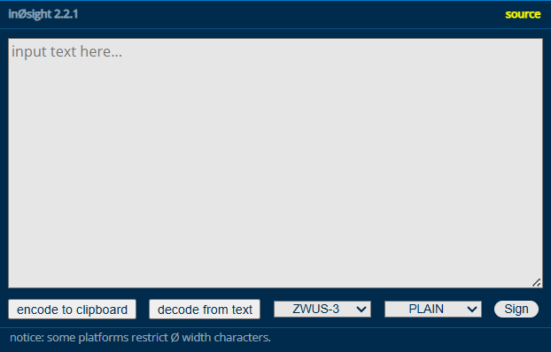

<h1 align="center">inØsight</h1>

This sentence contains hidden text you can only read by installing inzerosight.‍​­‌‍‏‎‏‌⁠‍⁠‌⁠‍­‌­‎‏‌⁠‏‍‌­​‏‌⁠‏­‌⁠‏‏‌‏‏­‌‎­‌⁠­‏‌⁠‍⁠‌⁠‏⁠‌‎­‌­​⁠‌­​‏‌⁠‍­‌‎­‌⁠‍­‌⁠‍⁠‌⁠‏‎‌‎­‌­​⁠‌⁠‍⁠‌⁠‍‏‌⁠‍‏‌⁠‏⁠‌⁠‍­‌­‎⁠‌­​⁠‌­​‏‌⁠‏­‌­​‎‌‎­‌⁠‏‏‌­​‎‌­​⁠‌⁠‏‍‌­​‎‌⁠‏­‌⁠‍‍‌⁠­‏‌‎­‌­‎⁠‌⁠‍­‌‎­‌⁠‍​‌⁠‍‍‌­​‏‌­‎⁠‌⁠‍­‌‎­‌⁠‏‏‌­‎⁠‌­‎‏‌­‎­‌⁠‏­‌‏‏​

<a href="https://addons.mozilla.org/en-US/firefox/addon/in0sight/">Firefox Add-on</a> · <a href="https://chromewebstore.google.com/detail/acnmohbphjmnbaboacmecidopeplkhog">Chrome Web Store</a>

---

  

  

### Sign
When enabled, prepends an invisible zero-width signature to the output. This allows inØsight to automatically detect hidden messages across web pages, identify the base and cipher, and show the on-screen decode button.

## How ZWUS Works

ZWUS (Zero Width Unicode Standard) hides messages in plain sight by converting text into completely invisible Unicode characters:

1. **Convert:** Translates each character (or encrypted data) into numeric values.
2. **Encode:** Maps those numbers into a custom alphabet of zero-width, invisible characters separated by an invisible delimiter.

The resulting text looks completely empty or hidden between ordinary letters. Decoding simply reads the invisible characters and reconstructs the original text.

For details regarding picking the optimal standard/base, see [docs/zwus.md](docs/zwus.md).

For cipher details, see [docs/cipher.md](docs/cipher.md).

## Use ZWUS in Your Own Projects

The encoder/decoder is available as a standalone package for multiple languages:

- **JavaScript/TypeScript:** [zwus on npm](https://www.npmjs.com/package/zwus)
- **Rust:** [zwus on crates.io](https://crates.io/crates/zwus)

> [!NOTE]
> Encoding works with **all Unicode characters in existence** (`U+0000` to `U+10FFFF`), including every language script, emoji, and symbol.
